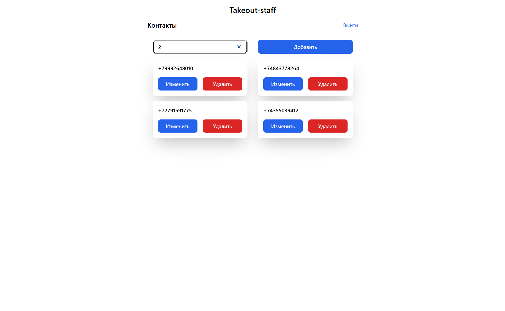

# TakeoffStaff Contact Manager



An example of full-stack contact management application with a React frontend and Node.js backend

## Getting Started

This project consists of two parts: frontend and backend.

### Frontend Setup

The frontend is a React application with Tailwind CSS styling.

```bash
cd frontend
npm install
npm start
```

The frontend will run on `http://localhost:3000`.

### Backend Setup

The backend uses json-server for mock API and CORS support.

```bash
cd backend
npm install
npm start
```

The backend API will run on `http://localhost:3001` (or the port specified in index.js).

## Development

To run the full application, you'll need both the frontend and backend running simultaneously in separate terminals.

### Frontend Features
- Contact list management
- User registration and login
- React Router for navigation
- Redux for state management

### Backend
- JSON Server providing mock REST API
- CORS enabled for frontend communication
- JSON file-based data persistence